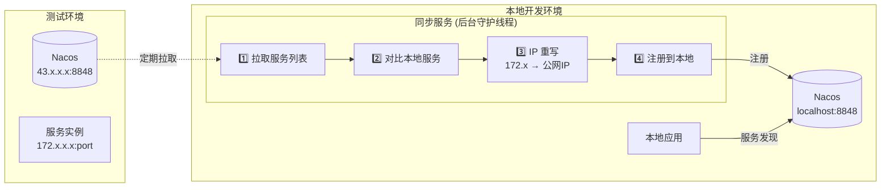
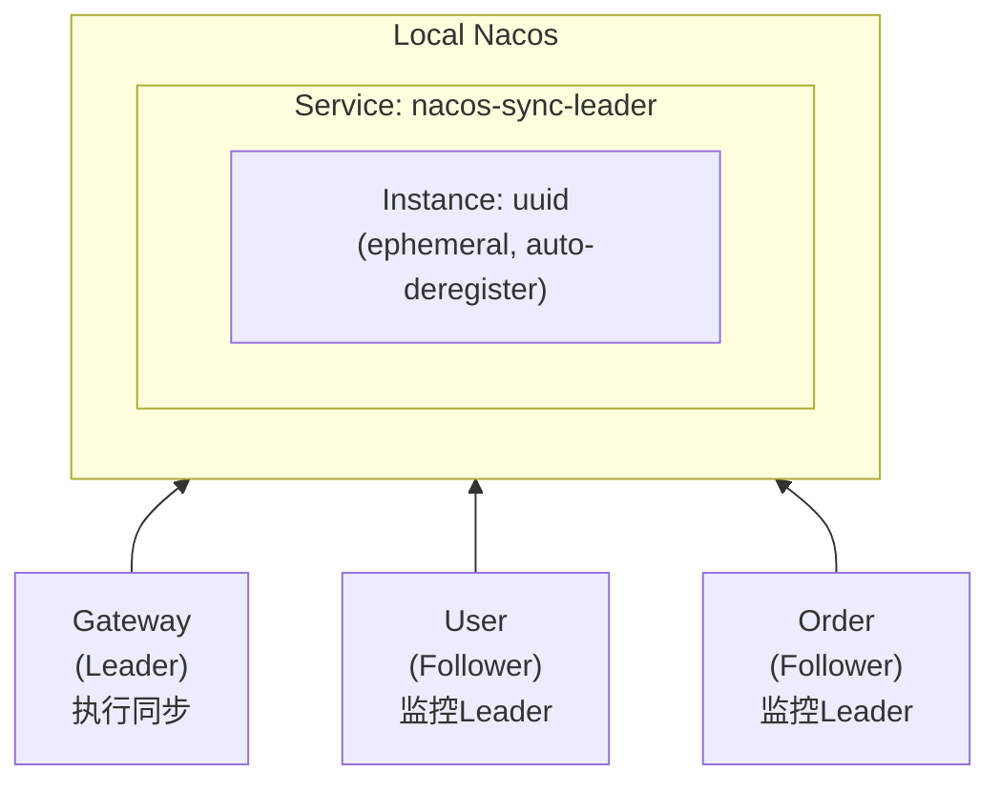

# Nacos Fallback Spring Boot Starter

本地开发环境下的 Nacos 服务同步机制,**定期从测试环境 Nacos 拉取服务并注册到本地 Nacos**,自动将内网 IP 重写为公网 IP。

## 快速开始

### 1. 添加 Maven 依赖

在 `weparty-common` 中，此 starter 仅在 `dev` profile 下引入：

```xml
<profiles>
    <profile>
        <id>dev</id>
        <dependencies>
            <dependency>
                <groupId>com.adealink.weparty.fungo</groupId>
                <artifactId>nacos-fallback-spring-boot-starter</artifactId>
                <version>1.0.0</version>
            </dependency>
        </dependencies>
    </profile>
</profiles>
```

**激活 dev profile：**

```bash
# Maven 命令行
mvn compile -Pdev
mvn package -Pdev

# 或在 IDE 中勾选 dev profile
```

### 2. 配置环境变量

在 `.env` 文件中添加以下配置（Spring Boot 会自动绑定到配置属性）:

```bash
# 必需配置
NACOS_FALLBACK_ENABLED=true
NACOS_FALLBACK_TEST_PUBLIC_IP=<your-test-public-ip>

# 可选配置（以下为默认值，按需修改）
# NACOS_FALLBACK_LOCAL_SERVER_ADDR=localhost:8848
# NACOS_FALLBACK_TEST_SERVER_ADDR=${NACOS_FALLBACK_TEST_PUBLIC_IP}:8848
# NACOS_FALLBACK_TEST_NAMESPACE=public
# NACOS_FALLBACK_TEST_PRIVATE_IP_PREFIX=172.
# NACOS_FALLBACK_SYNC_INTERVAL_SECONDS=60
```

### 3. 启动服务

启动服务后,同步任务会自动在后台运行。

> **提示**: 也可以在 `application.yml` 中配置，详见下方[配置参数说明](#核心组件)。

## 架构设计



## 核心组件

### 1. NacosFallbackProperties
配置属性类,管理同步相关配置:
- `enabled`: 是否启用同步
- `localServerAddr`: 本地 Nacos 地址
- `localNamespace`: 本地 Nacos 命名空间
- `localGroup`: 本地 Nacos 分组
- `testServerAddr`: 测试环境 Nacos 地址
- `testNamespace`: 测试环境命名空间
- `testGroup`: 测试环境分组
- `testPublicIp`: 测试环境公网 IP
- `testPrivateIpPrefix`: 内网 IP 前缀(用于识别)
- `syncIntervalSeconds`: 同步间隔(秒)
- `leaderServiceName`: Leader 选举服务名称(默认: `nacos-sync-leader`)
- `leaderCheckIntervalSeconds`: Follower 检查 Leader 健康的间隔(默认: 10秒)
- `leaderElectionWaitMs`: Leader 选举等待时间，用于处理竞争条件(默认: 500毫秒)

### 2. NacosFallbackServiceDiscovery
服务同步核心逻辑:
- **Leader 选举**: 通过本地 Nacos 临时实例实现,只有 Leader 执行同步
- 连接本地和测试环境 Nacos
- 定期拉取测试环境服务列表
- 对比本地已有服务,只同步缺失的服务
- 重写内网 IP 为公网 IP
- 注册到本地 Nacos

### 3. NacosFallbackAutoConfiguration
自动配置类,负责启动同步服务

## 工作流程

1. **服务启动**:
   - 加载配置
   - 异步启动同步任务(不阻塞启动)

2. **初始化连接**:
   - 连接本地 Nacos

3. **Leader 选举**:
   - 尝试在本地 Nacos 注册 `nacos-sync-leader` 临时实例
   - 如果注册成功,成为 Leader,执行同步任务
   - 如果已有 Leader,成为 Follower,定期检查 Leader 健康状态

4. **Leader 行为**:
   - 连接测试环境 Nacos
   - 立即执行首次同步
   - 定期同步(默认60秒间隔)
   - 服务停止时释放 Leader 身份

5. **Follower 行为**:
   - 定期检查 Leader 是否存活(默认10秒间隔)
   - 如果 Leader 消失,尝试成为新 Leader
   - 成功后接管同步任务

6. **定期同步** (仅 Leader):
   - 拉取测试环境所有服务列表（分页获取，每页100条）
   - 对比本地已有服务
   - 如果本地存在原生实例（非 fallback），跳过该服务并清理其 fallback 实例
   - 只同步本地 Nacos 没有原生实例的服务
   - **增量更新**: 对比本地与测试环境实例，只处理有变化的实例（先增后删，减少抖动）
   - 对每个新增实例进行 IP 重写并注册到本地 Nacos
   - 清理不再存在于测试环境的服务的 fallback 实例

7. **服务调用**:
   - 应用从本地 Nacos 发现服务
   - 可以发现本地服务 + 已同步的测试环境服务
   - 完全透明,无需修改业务代码

## Leader 选举架构



**选举流程**:
1. 多个服务同时启动时,第一个成功注册 `nacos-sync-leader` 的成为 Leader
2. 使用 `startTime` 元数据解决竞争条件,最早启动的获胜
3. Leader 停止时,临时实例自动注销,其他 Follower 检测到后竞选新 Leader

## 日志输出

启用后会有以下关键日志:

### Leader 日志
```
INFO  - Initializing Nacos fallback sync service, instanceId: abc-123-def
INFO  -   Local Nacos: localhost:8848
INFO  -   Test Nacos: 43.x.x.x:8848
INFO  -   Sync interval: 60 seconds
INFO  - Connected to local Nacos: localhost:8848
INFO  - Registered as sync leader with instanceId: abc-123-def
INFO  - This instance became the sync leader
INFO  - Connected to test Nacos: 43.x.x.x:8848
INFO  - Found 15 services in test environment
INFO  - Syncing service weparty-gift with 2 instances to local Nacos
INFO  - Registered service weparty-gift instance to local Nacos: 43.x.x.x:8201 (original IP: 172.17.0.5)
INFO  - Synced 3 services from test to local Nacos
INFO  - Nacos fallback sync started, interval: 60 seconds
```

### Follower 日志
```
INFO  - Initializing Nacos fallback sync service, instanceId: xyz-456-uvw
INFO  - Connected to local Nacos: localhost:8848
INFO  - Found existing leader: abc-123-def
INFO  - Another instance is the sync leader, this instance will monitor leader health
INFO  - Leader health check started, interval: 10 seconds
```

### Leader 故障转移日志
```
INFO  - No healthy leader found, trying to become leader
INFO  - Registered as sync leader with instanceId: xyz-456-uvw
INFO  - Successfully became the new sync leader
INFO  - Connected to test Nacos: 43.x.x.x:8848
INFO  - Nacos fallback sync started after leader election, interval: 60 seconds
```

## 优势

1. **不阻塞启动**: 异步初始化和同步,完全不影响服务启动速度
2. **单点同步**: 通过 Leader 选举,只有一个服务执行同步,避免重复操作
3. **自动故障转移**: Leader 停止后,其他服务自动接管,保证同步持续
4. **透明性**: 对业务代码完全透明,无需修改服务调用代码
5. **稳定性**: 服务实例已在本地 Nacos,服务发现速度快且稳定
6. **智能同步**: 只同步本地缺失的服务,避免冲突
7. **IP 重写**: 自动将内网 IP 重写为公网 IP,解决网络隔离问题
8. **增量更新**: 对比实例变化,只更新有差异的实例,避免服务抖动
9. **心跳保活**: Nacos SDK 自动维护心跳(5秒间隔),临时实例持续健康
10. **自动清理**: 当测试环境服务消失或本地有原生实例时,自动清理 fallback 实例
11. **灵活配置**: 可配置同步间隔、命名空间、分组等
12. **无额外依赖**: Leader 选举利用本地 Nacos,无需 Redis/Zookeeper

## 注意事项

1. **Maven Profile**: 在 `weparty-common` 中需要激活 `dev` profile 才会引入此依赖
2. **网络连通性**: 确保本地开发环境能够访问测试环境的公网 IP 和端口
3. **端口映射**: 确保测试环境的服务端口可以通过公网 IP 访问
4. **命名空间隔离**: 建议使用不同的 namespace 区分环境
5. **服务冲突**: 如果本地已有同名服务,不会被覆盖
6. **同步间隔**: 根据实际需求调整同步间隔,避免频繁同步

## 故障排查

### 问题 1: 同步服务未启动

检查项:
- 确认 Maven `dev` profile 已激活
- 确认 `NACOS_FALLBACK_ENABLED=true`
- 查看启动日志是否有 "Initializing Nacos fallback sync service"
- 检查自动配置是否生效

### 问题 2: 无法连接测试环境 Nacos

检查项:
- 确认测试环境 Nacos 地址和端口正确
- 确认网络连通性: `telnet 43.x.x.x 8848`
- 查看日志错误信息

### 问题 3: 服务未同步到本地

检查项:
- 确认测试环境 Nacos 中服务已注册
- 确认 namespace 和 group 配置正确
- 检查本地 Nacos 是否已有同名服务
- 查看同步日志

### 问题 4: 无法连接同步的服务

检查项:
- 确认公网 IP 配置正确
- 确认本地网络能访问公网 IP
- 确认服务端口已开放
- 在本地 Nacos 控制台查看服务实例的 IP 和端口

## 禁用同步

如果需要禁用同步机制,有两种方式:

1. 修改 `.env` 文件:
   ```bash
   NACOS_FALLBACK_ENABLED=false
   ```

2. 在启动参数中覆盖:
   ```bash
   -Dnacos.fallback.enabled=false
   ```

## 查看同步状态

可以通过 Nacos 控制台查看同步的服务:

1. 打开本地 Nacos 控制台: http://localhost:8848/nacos
2. 进入"服务管理" -> "服务列表"
3. 查看带有 `metadata.fallback=true` 的服务实例
4. 这些就是从测试环境同步过来的服务
5. 查看 `nacos-sync-leader` 服务,可以看到当前的 Leader 实例

## 技术实现

- **Leader 选举**: 利用 Nacos 临时实例(ephemeral)实现,服务停止自动注销
- **竞争条件处理**: 使用 `startTime` 元数据,多个实例同时注册时最早的获胜
- **定时任务**: 使用 `TaskScheduler` 实现定期同步和 Leader 健康检查
- **增量同步**: 以 `ip:port` 为 key 对比实例变化,先增后删减少抖动
- **心跳保活**: Nacos SDK 自动为临时实例维护心跳(默认5秒),无需手动管理
- **异步处理**: 所有同步操作异步执行,不阻塞主线程
- **守护线程**: 同步线程设置为守护线程,不影响 JVM 退出
- **Spring Boot 自动配置**: 利用 Spring Boot 自动配置机制
- **条件注解**: 使用 `@ConditionalOnProperty` 控制是否启用
- **Nacos SDK**: 使用 Nacos Java SDK 进行服务注册和发现
- **生命周期管理**: 使用 `initMethod` 和 `destroyMethod` 管理同步服务生命周期

## License

Apache License 2.0
